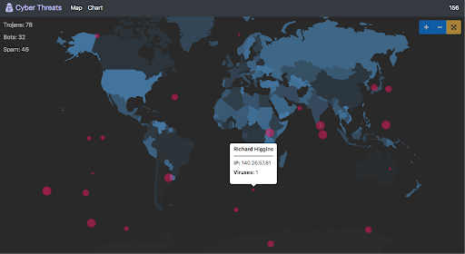
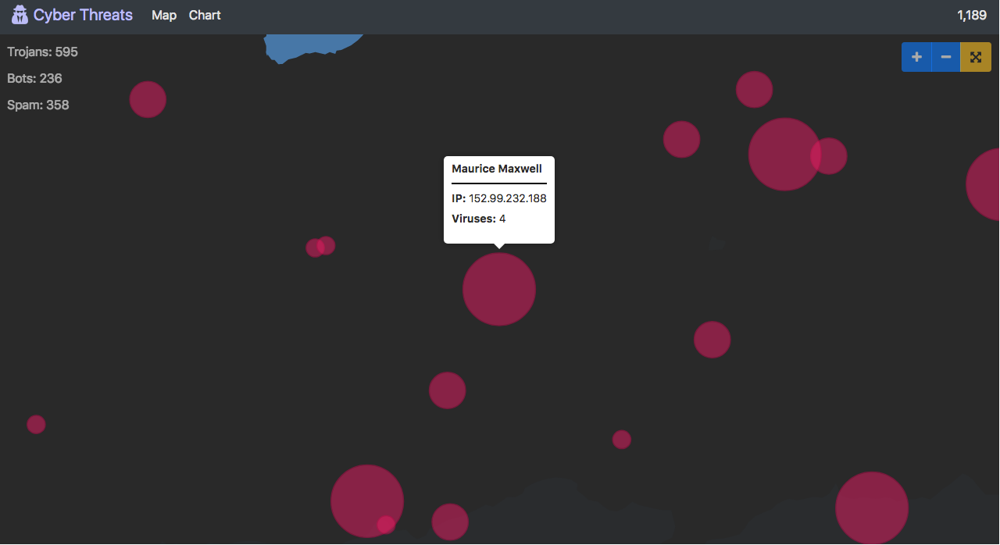

# Threat Map

> #### UI Challenge
> Create a map dashboard showing network related information associated with a set of IP addresses distributed across the globe and the US.  

## Configuring
Clone or download codebase

install dependencies with `npm install`

## Running

#### Production
`npm run build:prod` Creates distribution files under `dist/`

`npm run server` will run server at localhost:8080

To load the application, navigate to **[localhost:8080](http://localhost:8080)** in your browser.

#### Development 
`npm start` will run webpack-dev-server will run at localhost:5000 

`npm run server` will run server at localhost:8080

To load the application, navigate to **[localhost:5000](http://localhost:5000)** in your browser.

## Testing  
`npm run ava` will run all tests 

TODOs: 
* Create client tests
* Add socket tests

## Features 

#### Routes
Use the navbar links (Map & Chart) to route between *Map* view and *Bar Chart* views (Chart is not implemented).

#### Threat data counters 
To the right of the navbar is a *Total Virus Counter*.

To the left of the map are *Virus Counters* for:
* Trojans
* Bots
* Spam

#### Map Panning 
*Click* and *Drag* to pan map

#### Marker Animmations
There will be *Expanding* and *Flashing Animations* for each new threat.

#### ToolTips 
*Hovering* over a *Marker* will display a tooltip with threat information.

#### Zoom Functionality

To the right of the map are buttons for changing map Zoom levels.
* Zoom-In
* Zoom-Out
* Reset 

Alternatively, *Click* on a *Marker* to zoom and center on that marker. *Click Again* to zoom out.
